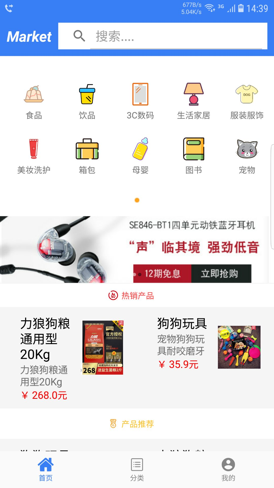
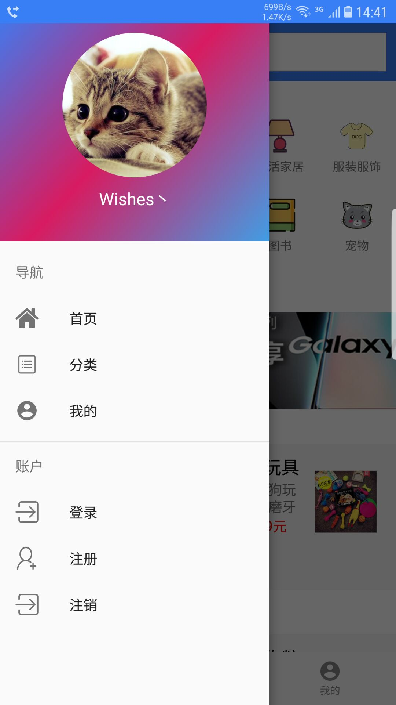
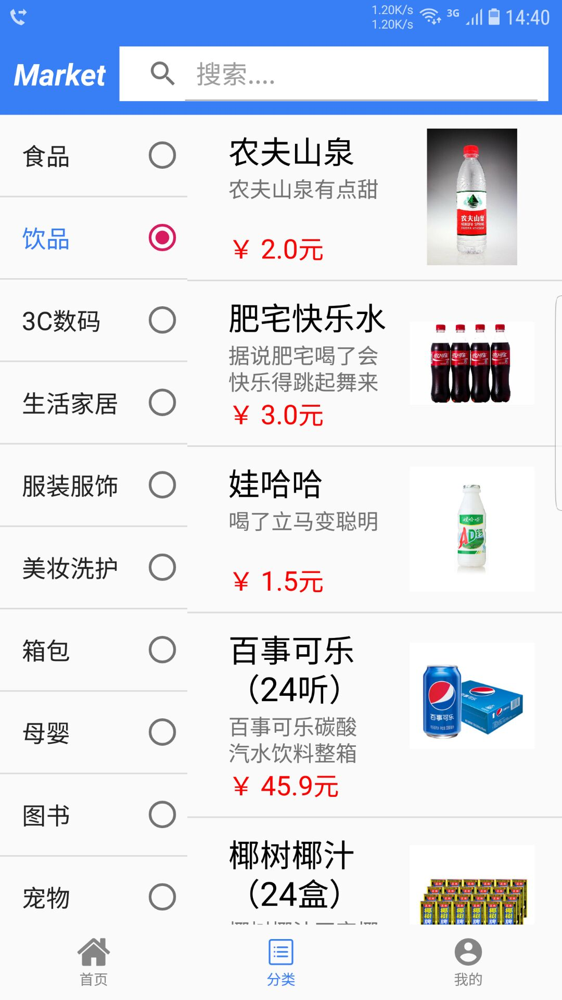
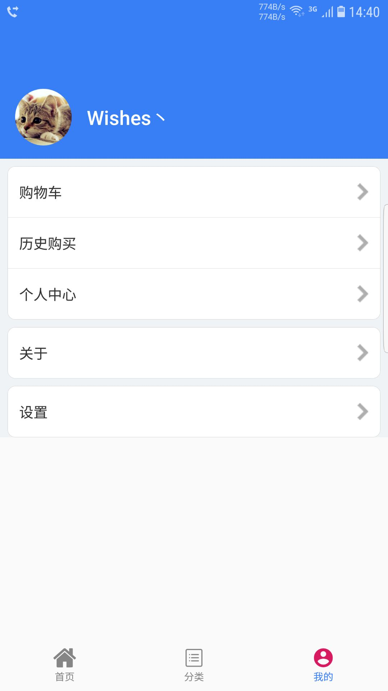
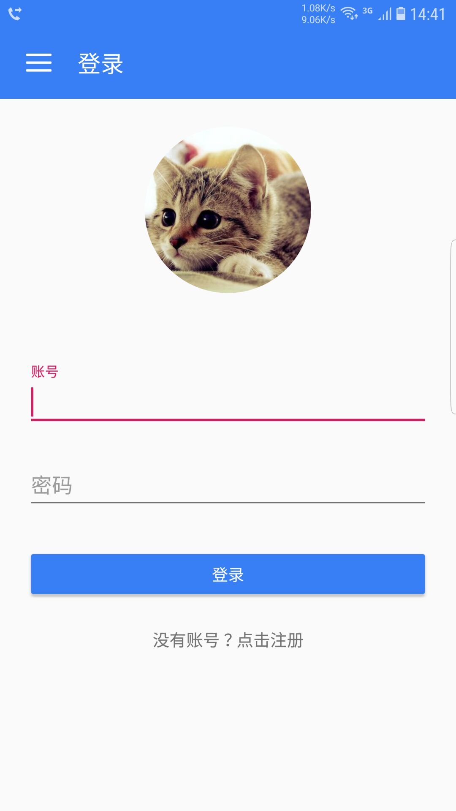
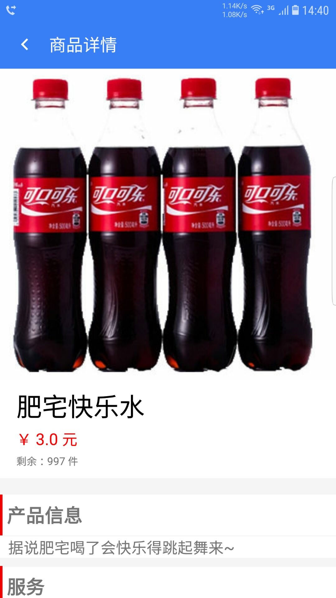
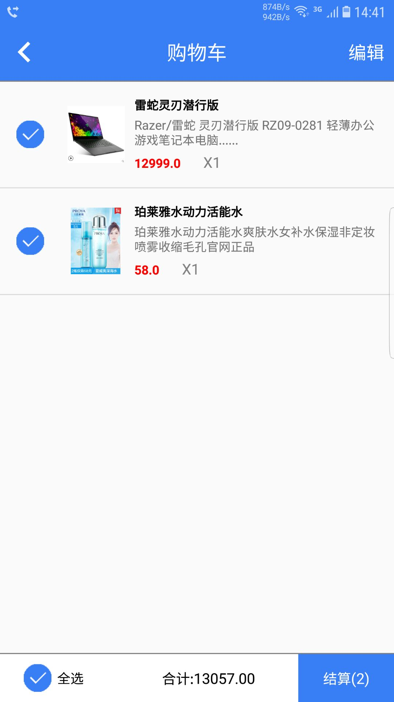
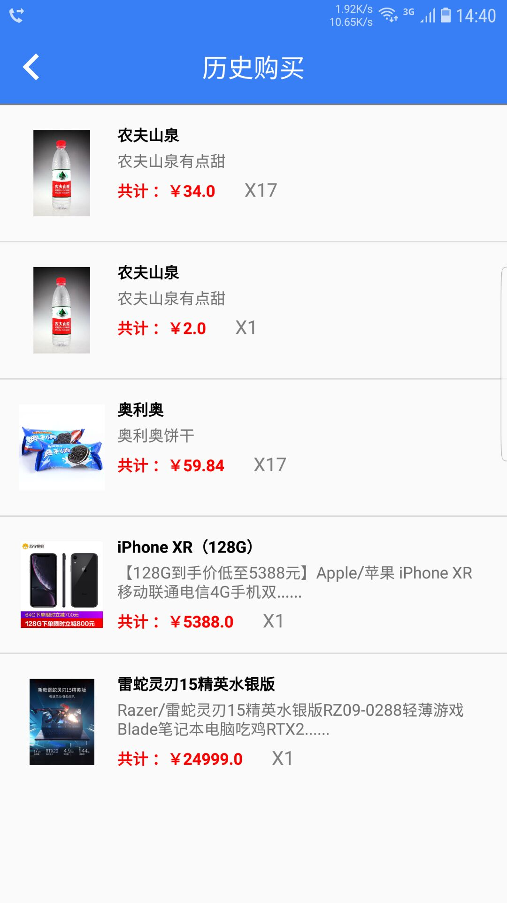

# 项目说明

> 提供了一个简易的购物商城App的实现思路，能完成大部分购物商城应有的功能。其中：添加收货地址，添加收货人信息，使用支付宝/微信支付等功能未开发   ~~(也不打算开发)~~  
>
> 希望可以给大家完成自己的商城App提供一个思路！

##注：公网服务端已停服，请自行私有化部署进行测试，或下载单机版体验功能！

## 开发环境
* Android Studio 3.2 
* gradle 4.6

## 功能说明
> 实现功能：
> * 账号注册、登录
> * 商品查询（按商品名，按商品类别等）
> * 点击查看商品详情，查看商品缩略图详情等
> * 添加商品进购物车、查询购物车
> * 模拟购买商品、查询购买历史

## 开发/编译/调试
1、确保开发环境没有问题  
2、本地环境部署请下载服务端源码：[Market Server](https://github.com/a1098832322/MarketServer)  
3、/app/src/main/java/com/sqh/market/constant/Constants.java 文件下  
修改BASE_URL的地址为你本地的服务端地址。若仅测试使用，则使用默认地址：http://wishes-blog.cn/market

## 运行
* 初次运行，软件会弹出权限请求弹窗，请给予相应权限；  
* Android 6.0 、 7.0、 8.0可用。  6.0版本以下不可用，8.0以上系统不保证能正常使用。 各机型没有条件做适配，能不能用看个缘~
* 样例Apk和默认代码编译出来的Apk使用的都是我云服务器地址。因为云服务器带宽较低，所以商品信息及菜单拉取速度较慢。这里比较推荐你们架设自己的Server端。方法参考：开发/编译/调试 说明
* 单机版demo下载：
> [单机版demo](https://github.com/a1098832322/MarketAndroidApp/blob/master/release/%E5%8D%95%E6%9C%BA%E7%89%88%E6%9C%ACdemo.apk)  
> [网络版demo](https://github.com/a1098832322/MarketAndroidApp/blob/master/release/%E8%81%94%E7%BD%91%E7%89%88Demo.apk)

## 图示
* 欢迎页

* 首页

* 首页2

* 商品分类

* 个人页

* 登录/注册

* 商品详情

* 购物车

* 购买历史

